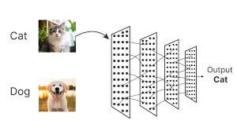

Hello fellow readers, I am Joshua Adrian Cahyono, a Year 3 student at NTU studying Data Science and AI.
As of the time of writing this, I have been learning and doing AI research for just over 2 years.
I want to share my journey into AI and how I got started with AI, as well as a bit of my personal tips on how to navigate through AI research as a student. Though I may not be as good or experienced as industry experts and researchers in AI, I do hope I bring a fresh perspective to the table especially for NTU students in starting their AI journey.

# My Personal Journey into AI

## Where it all began...
The word "AI" has been around for quite a while, but it has only recently become a real game changer.
The first real instance of me being interested in AI was when I was in highschool just before going to university.
Do note at that time, there was no ChatGPT yet. However, I was first fascinated by the [documentary](https://www.youtube.com/watch?v=WXuK6gekU1Y) on AlphaGo by Deepmind. As a chess and go player, I was amazed by the fact that a computer program could beat the best players in the world in a game that is considered to be "impossible" for a computer to win against humans for a long time, due to the complexity of the game, sheer size of search space, and its "creative" nature. However, brilliant scientists at DeepMind managed to achieve this feat. Over time, many other AI breakthroughs were made, and the field of AI has been growing rapidly ever since.

## The Start of My AI Journey
This was the reason I decided to go apply to Data Science and AI at NTU. At that time, I cannot wait to start learning even before entering university. This was when I first started learning from the [Deep Learning Course](https://www.coursera.org/learn/neural-networks-deep-learning?specialization=deep-learning) offered by DeepLearning.ai. (and I still highly recommend it for beginners in Deep Learning!) As someone into math, I was very excited to learn about the math behind neural networks, and how they are trained using gradient descent. It feels amazing to see the math I love transformed into real life applications. The capstone project in the course was also a great experience as I got to apply the knowledge and implement a simple neural network from scratch.

<figure style="text-align: center;">
  
  <figcaption>Figure 1: My first neural network for cat vs dog classification</figcaption>
</figure>
