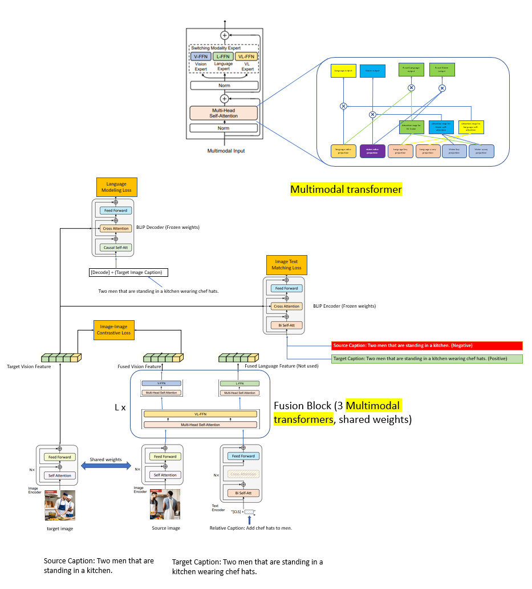

Hello fellow readers, I am Joshua Adrian Cahyono, a Year 3 student at NTU studying Data Science and AI. As of the time of writing this, I have been learning and doing AI research for just over 2 years.

I want to share my journey into AI and how I got started with AI, as well as a bit of my personal tips on how to navigate through AI research as a student. Though I may not be as good or experienced as industry experts and researchers in AI, I do hope I bring a fresh perspective to the table especially for NTU students in starting their AI journey.

# My Personal Journey into AI

## Where it all began...

The word "AI" has been around for quite a while, but it has only recently become a real game changer. The first real instance of me being interested in AI was when I was in highschool just before going to university.

Do note that there was no ChatGPT yet at the time. However, I was first fascinated by the [documentary](https://www.youtube.com/watch?v=WXuK6gekU1Y) on AlphaGo by Deepmind. As a chess and go player, I was amazed by the fact that a computer program could beat the best players in the world in a game that is considered to be "impossible" for a computer to win against humans for a long time, due to the complexity of the game, sheer size of search space, and its "creative" nature. However, brilliant scientists at DeepMind managed to achieve this feat. Over time, many other AI breakthroughs were made, like ChatGPT and DALL-E, and the field of AI has been growing rapidly ever since. These innovations have been changing the world and our lives in many ways, and it is exciting to not only see the progress, but also be part of it.

## The Start of My AI Journey
It was for the excitement of these AI innovations that I decided to go apply to Data Science and AI at NTU. At that time, I cannot wait to start learning even before entering university. This was when I first started learning from the [Deep Learning Course](https://www.coursera.org/learn/neural-networks-deep-learning?specialization=deep-learning) offered by DeepLearning.ai. (and I still highly recommend it for beginners in Deep Learning!) As someone into math, I was very excited to learn about the math behind neural networks, and how they are trained using gradient descent. It feels amazing to see the math I love transformed into real life applications. The capstone project in the course was also a great experience as I got to apply the knowledge and implement a simple neural network from scratch.

<figure style="text-align: center;">
  
  <figcaption>Figure 1: My first neural network for cat vs dog classification</figcaption>
</figure>

From there I started to learn more about AI and the subfields of AI, such as Computer Vision, Natural Language Processing, RL, and more. After ChatGPT's release, I also started to learn about the latest research in AI, such as Generative AI, and the latest breakthroughs in the field. I will list more of my learning resources in the [Learning Resources](#learning-resources) section.

## Research Experiences

### 1. MLDA (Machine Learning Data Analytics) Research Group (Year 1) - Visual Retrieval
[Github](https://github.com/JvThunder/BLIP)

I started my AI research journey in Year 1 as part of MLDA at NTU, a group focused on applying machine learning to real-world problems. Fresh out of my courses and still exploring my interests, I joined the research team and was assigned to a collaborative project with Huawei on optimizing models for **Visual Retrieval from image and modification prompt**, mentored by Huawei researchers.

As a team of five with little research experience, the project was daunting. Our collaboration with Huawei researchers was challenging, as their availability was limited, and we were still grasping the fundamentals of research. Despite this, it was an invaluable experience. It was my first time working in a research team, and I learned a lot.

We began with a literature review on Visual Retrieval, taking turns presenting papers and brainstorming improvements. I loved the process of discussing new ideas and experimenting with solutions. However, implementing our approach was tough, especially since I was new to PyTorch and had to learn it on the go. In the end, we managed to implement it yet unable to improve the performance significantly. Although we didn’t complete the project, I have no regrets. It deepened my passion for research and even helped me land my first research internship. 

<figure style="text-align: center;">
  
  <figcaption>Figure 2: Our Architecture Idea for Visual Retrieval Based on BLIP</figcaption>
</figure>

### 2. A*STAR (Year 2) - Offline RL for Medical Recommendation
TODO