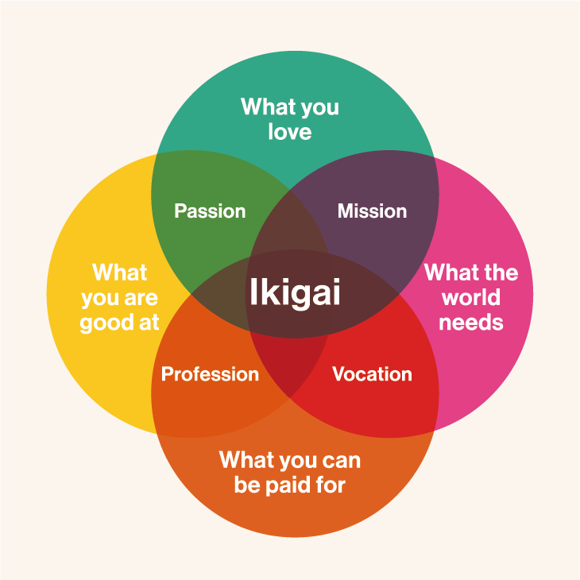

Recently, I've been contemplating what the best path to achieving *greatness* really is, especially after seeing people succeed in so many different ways. *Greatness* is not necessarily the path towards becoming a multi-millionaire, but it is a path towards doing work that matters and making a difference in the world. 

A lot of people believe that gaining capital as early and as much as possible is probably the best policy in life. It's no wonder, then, that many of my smart friends aim for internships or full time position at quant companies. Some succeed and end up earning insane amounts of money (for context, the highest salary I know of is around **$200k/year** even for interns, crazy, I know). Sometimes that makes me jealous, and I find myself wondering: why don't I try going for it too? With my background of winning multiple national and international Math and Coding Olympiads, I'm confident that if I dedicated 2-3 years to focused preparation, I could probably excel at the types of questions and interviews given by quant companies, and potentially have a decent chance of getting in. (I hope this does not come off as bragging, as I only intend to use this for my argument)

But then another part of me starts to question: Would that really be the best path for me? Is that *really* what I want? For one, I'm not particularly interested in the work quants do. Personally, I don't think it contributes to society in a very meaningful way. I don't see myself doing any great work in that field. Of course, some would argue that with the kind of money you can make, even after just 3-4 years in the quant industry, you could do a lot of good.

So I thought to myself: is it better to be a millionaire with no direct applicable skills, or to aim to become part of the top 1% in your field, contributing to society in a meaningful way and solving important problems? (Well, technically quants do gain strong skills in low-level programming and/or advanced financial math, and both are very difficult, but arguably not so transferable) Some might choose the former. But I would argue that, when it comes to pursuing greatness, the latter matters more. Just as money can compound, so can skills and expertise.

**Disclaimer:** *I can write this from a place of contentment. Financially, although I am not from a rich family background even in Indonesian standards, I feel secure and don't have external pressure to chase money as quickly as possible. More importantly, I constantly feel the blessings Jesus gives in my life. I believe that whatever I receive, be it power, status, or wealth, ultimately comes from Him and should be used for His glory. Even if I were to become rich, I wouldn't use money just for myself, and I hope I can continue to live quite modestly. I know not everyone can have this kind of privilege, so this is not a judgement on anyone but rather a reflection on my own life.*

People say I can do whatever I want when I have money, but is money really the only thing stopping me do what I really want to do now? Like I said, I feel content with how I live now, so why wait to do what I want in the first place? When will you feel enough with your money? Even if I would have a million dollars by then, I might not be sure what good I could directly do with it. Sure, I could donate to charity, but that is limited and probably a one-off thing. I could try starting a company, but without deep expertise, I would not really know what kind of business to build. I wouldn't want to retire early either, and that is never the point of doing great work. Personally, I lean toward building tech companies and non-profit organizations that bring real value to society. And while I could hire experts and start something, what direction should I pursue if I am not confident in any of the fields myself? So, I think that greatness does not come from being rich, at least not by default.

On the other hand, if I dedicate myself to focus on doing good quality work, and aim to become one of the top researcher or practitioner in a field, I can imagine many more ways to contribute. Maybe along the way I'd find like-minded people to build amazing AI products for society. Maybe some of my research would turn into important work that gets widely adopted-like the Transformers paper (one of the most important breakthroughs in AI history). Maybe I'd even become a professor at a top university, leading others to do great work and pursue their dreams. Of course, like most things in life, luck would play a role. But still, I can see this path as a better route towards greatness.

I'm tired of listening to what the world deems as the best path to success. So from now on, I think I will start focusing on my convictions: striving to become a great AI researcher while solving important problems in society. I'm especially concerned about the future of AI, and I hope to help nudge the needle toward safer AI that benefits society as a whole, and not just the rich and elite. Looking at people often regarded as *great*: Elon Musk, Steve Jobs, Bill Gates, Jensen Huang, Demis Hassabis, I notice they share certain traits: discipline, focused, strong principles, exceptional mastery of their craft and pursuing things bigger than themselves. Those are the qualities I want to embody as I pursue this journey. There are definitely risks and uncertainties, but in this ever-changing era of AI, **not taking any risks is a risk in itself**. 

I think this is my [**ikigai**](https://en.wikipedia.org/wiki/Ikigai), my calling in life, and I want to start living it fully. I don't have to be considered successful by the world's standards. Instead, I want to dedicate my life to serving others. That is why I constantly seek ways to create meaningful projects, like [PYPHub](https://pyphub.ntuscds.com/), and volunteer to regularly teach children in Batam. My goal is to help, serve, and make a positive impact on peoples lives. Only when I continue doing this until the end of my life, then I can say that I am successful. This is what I consider to be greatness.

<figure style="text-align: center;">
  
  <figcaption>Figure 1: Ikigai Diagram</figcaption>
</figure>

Well, this is more of a rant and my chain of thought reasoning and this serves as my personal journal for the future me, but hopefully it will be the inspiration for many others too. For those of you who don't care about *"doing great work"* and just want a life chasing after money and position to have a stable life, all of this might sound silly and idealistic, maybe even childlike. And honestly, you might be right, I am still young with a youthful and *"naive"* mind. I also think that aiming for a comfortable and stable family life is a perfectly valid way of living, and I respect anyone who chooses it.

For the like-minded individuals out there, believe in what you stand for, find your ikigai, and do not be swayed or distracted by others who have different goals in life. **I think the challenge in life is that there are so many pieces of advice and so much noise out there. We need to learn how to filter them out, focus on what truly matters, and choose to listen to the people we actually aspire to become.** For the Christians out there, remember to always focus on serving others and building God's kingdom and glory, more than our own personal gains. 

If you disagree with any of the arguments above, feel free to discuss with me about this, I would love to learn more about others' perspectives. And finally, my last remark: **"If you can do it, then why aren't you solving one of the most important problems in your respective fields?"** :)

*"In the same way, let your light shine before others, that they may see your good deeds and glorify your Father in heaven."* - **Matthew 5:16 (ESV)**